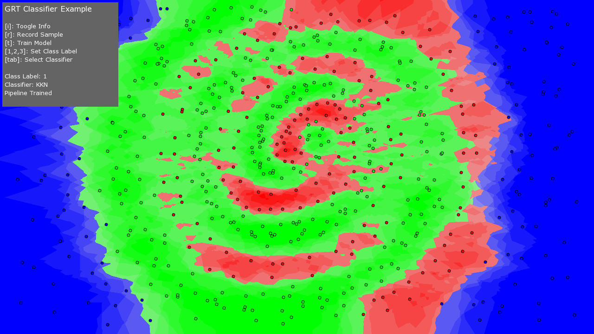

#ofxGrt

This repo contains an [openFrameworks](http://openframeworks.cc) extension for the [Gesture Recognition Toolkit](https://github.com/nickgillian/grt) (GRT).

The GRT is a cross-platform, open-source, C++ machine learning library designed for real-time gesture recognition.

This extension is designed to make it as easy as possible to use the GRT in openFrameworks.

Note that this extensions contains a local version of the GRT as a git submodule, which will be compiled from source when you build any of the ofxGrt examples.

To use ofxGrt:

- download openFrameworks (you will need an OF version that supports C++11, you can find the latest version on the openFrameworks github page)

- clone this repo to the openFrameworks addons folder
```
    cd openFrameworks/addons
    git clone https://github.com/nickgillian/ofxGrt
    cd ofxGrt
    git submodule init
    git submodule update
```

- if you are working off any branch of ofxGrt that is not master (e.g., dev), then you can sync with the remote GRT version of that branch via:
```
    git submodule update --remote
```

- to build and run any of the ofxGRT examples, cd to an example folder and run:
```
    cd ofxGrt/example_timeseries_plot
    make
    make run
```

You can find additional README files in each of the examples that describe more details about each specific example.

##License
The ofxGRT is available under a MIT license.

##Examples

See the specific examples directories for a full description on each example.

[Classification Example](example_classification)


[Regression Example](example_regression)

