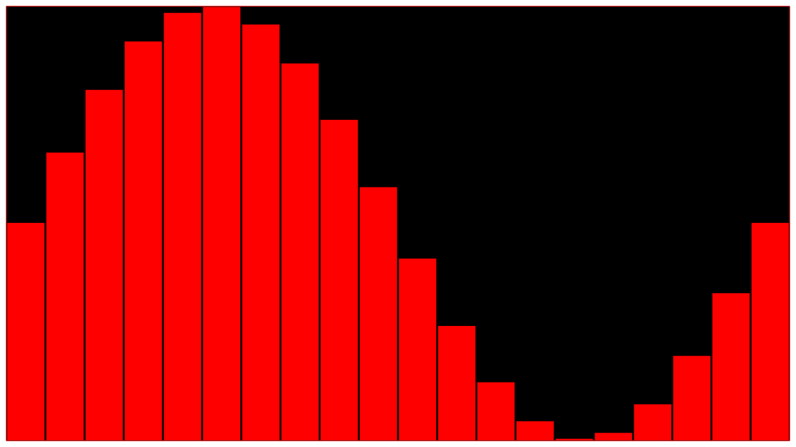

##Bar Plot Example

This example demonstrates the how to use ofxGrt Bar Plot class. 

The example will generate a basic sine wave signal and plot this using the bar plot class.



##Building and running the example
On OS X and Linux, you can build this example by running the following command in terminal:

````
cd THIS_DIRECTORY
make -j4
````

To run the example, run the following in terminal:

````
make run
````

##Using the example
To use this example, simply build and run it.