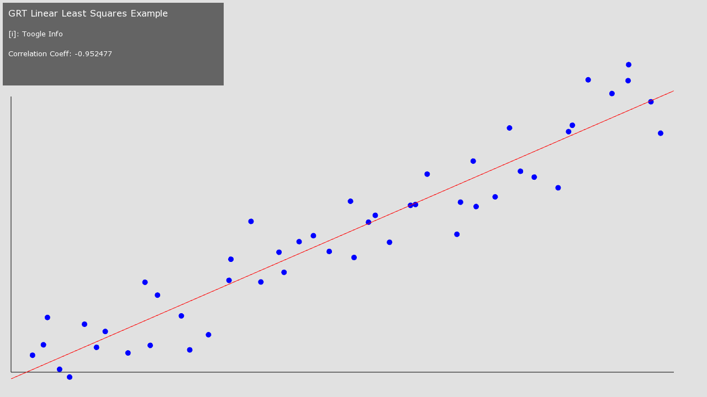

##Linear Least Squares Example

This example demonstrates the how to use GRT Linear Least Squares algorithms.  

The example will generate a basic linear dataset (using a linear trend plus some random noise) and fit a straight line to this dataset using the LinearLeastSquares algorithm.

The image below shows the random data points (in blue) and the estimated line fit to the dataset (in red).



##Building and running the example
On OS X and Linux, you can build this example by running the following command in terminal:

````
cd THIS_DIRECTORY
make -j4
````

To run the example, run the following in terminal:

````
make run
````

##Using the example
To use this example, simply build and run it.